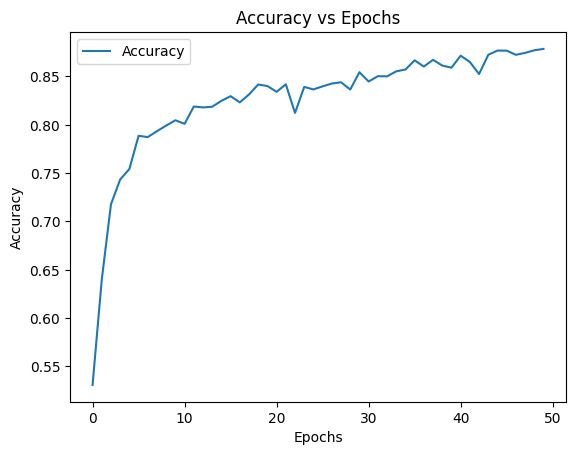
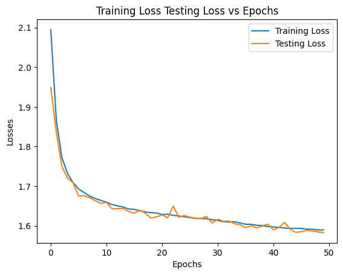

# Applications of VIT such as Image Classfication and Semantic Segementation from scratch 

This is an initution of VIT transfromers from scratch, where we will be doing Image Classfication and Semantic Segmentation and many more.  
For now we have complete Image Classfication results where we can see Good training results on laptop GPU, with proper parameters and huge dataset with varities of varitions of dataset will led with greater performance. 
 
In coming days, will implementing SegViT: Semantic Segmentation with Plain Vision Transformers paper wher will introduce a ATM (Attention-to-Mask) module, in which the similarity maps between a set of learnable class tokens and the spatial feature maps are transferred to the segmentation masks 
###Note -> Here I will paste my expirements results  below for Image Classfication on MNIST  

a) Accuracy vs Epochs

b) Loss vs Epochs

 
